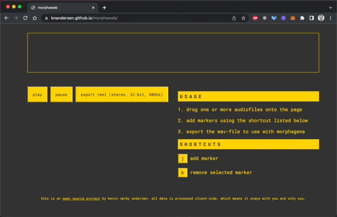

# Morphaweb

The goal of this project is to provide an easy solution to assembling reels for the Make Noise Morphagene module.

Demo available at: [https://knandersen.github.io/morphaweb/](https://knandersen.github.io/morphaweb/)